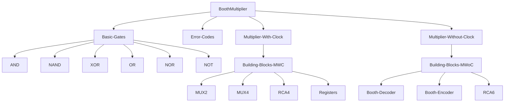

# Booth Multiplier Microwind

This repository contains all the files to make the Radix 4 Booth Multiplier. The layout of the repository is as shown below:
___

___
Made with :heart: by [Eloquencere](https://github.com/Eloquencere), [Tejas-M-Nayak](https://github.com/Tejas-M-Nayak), [spacebiz24](https://github.com/spacebiz24)
